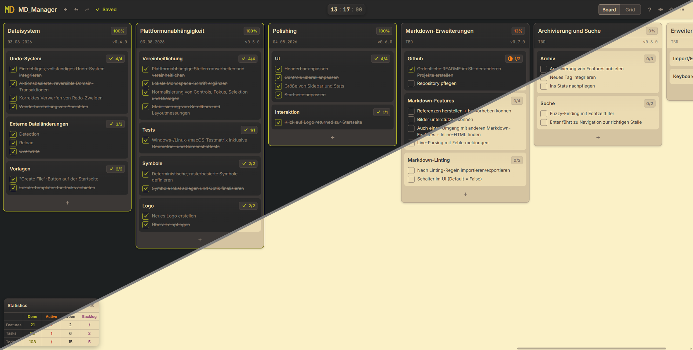
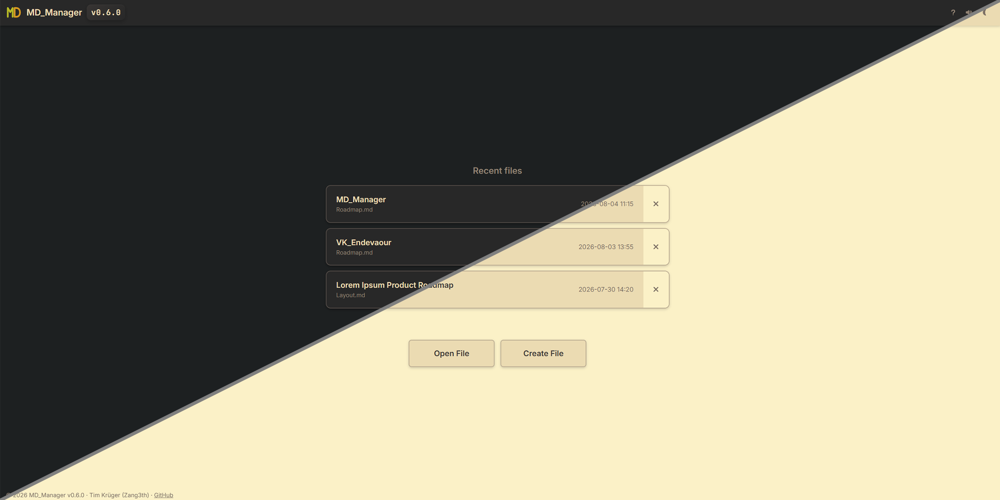
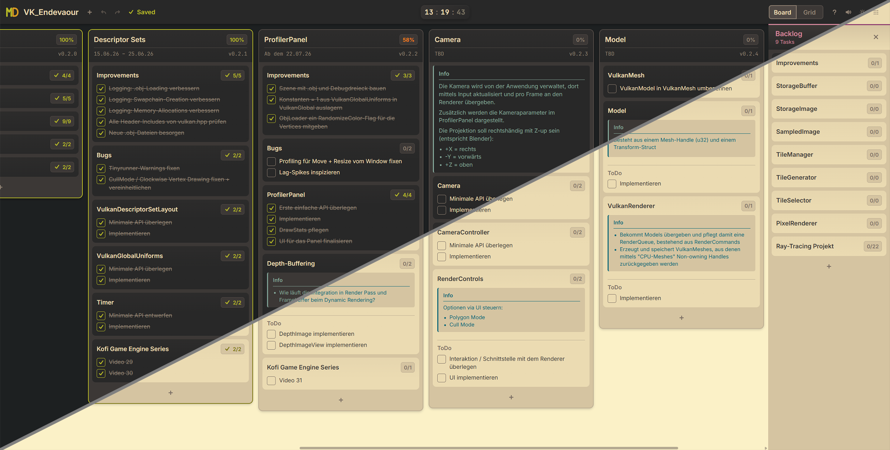
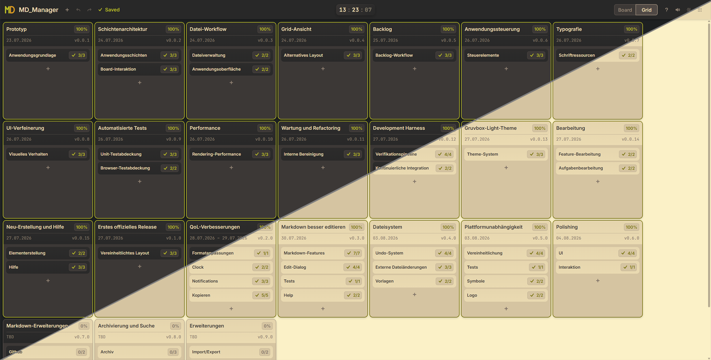
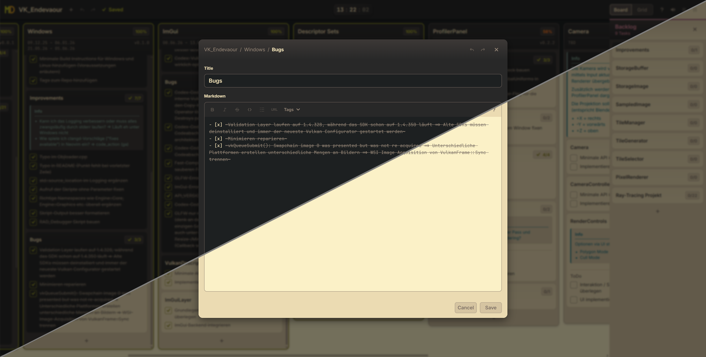

# MD_Manager

MD_Manager is an interactive, fully local Markdown project board for humans, Git, automation, and AI agents. Plan visually while keeping your project data in an open, human-readable format.



## Key features

- Visual planning on board or grid layouts. Optimized for both landscape and portrait monitors.
- Releases, tasks, todos, backlog, metadata, and progress tracking.
- Drag and drop, copy and paste, and keyboard controls.
- Undo and redo with view-state restoration.
- External-change detection, reload or overwrite resolution, and retryable saves.
- Markdown editing with tags, templates, and inline formatting.
- Fully local and offline, with no cloud services, installation, build step, or web server.

<table>
  <tr>
    <td width="50%"></td>
    <td width="50%"></td>
  </tr>
  <tr>
    <td align="center">Start page</td>
    <td align="center">Board view with backlog</td>
  </tr>
  <tr>
    <td width="50%"></td>
    <td width="50%"></td>
  </tr>
  <tr>
    <td align="center">Grid view</td>
    <td align="center">Markdown editor</td>
  </tr>
</table>

<p align="center"><em>Themes: Gruvbox Dark and Gruvbox Light.</em></p>

## Quick Start

### Launching

The application consists of plain HTML, CSS, and JavaScript. It has no build step, package-manager runtime, web server, framework, or CDN dependency.

Just open `MD_Manager.html` in a Chromium-based browser with support for the File System Access API.

### Markdown Example

An example is stored locally in [`data/parsing/Layout.md`](https://github.com/Zang3th/MD_Manager/blob/master/data/parsing/Layout.md) which also serves as the golden file for parsing.

### Data

- Markdown is the canonical project format.
- Parsing creates plain JavaScript state.
- Serialization writes state changes back to the open file.
- File handles for the five most recently opened projects are stored in IndexedDB.
  - Project content remains in its Markdown file.

The supported document hierarchy is:

```text
# Project
├── ## Feature
│   └── ### Task
│       ├── #### Grouping
│       └── - [ ] Todo
└── #Backlog
    └── ## Backlog feature
        ├── ### Backlog task
        └── ...
```

Supported tags:

- `#Version` and `#Date` define release metadata.
- `#Info` and `#Warn` add contextual notes to features and tasks.
- `#Ignore` preserves the following feature or task in Markdown while hiding it from the application.
- `#Backlog` starts the backlog section.

Supported formatting:

- `**bold**`, `*italic*`, `~strikethrough~`, and `` `inline code` ``.
- Links, paragraphs, and nested unordered lists.

## Technical implementation

MD_Manager uses a layered architecture built around Markdown as the data source. Pure domain operations manage state transitions independently of the DOM, the I/O layer handles parsing and local file access, and the UI layer renders state and delegates persistent changes back to the domain. `app.js` connects these layers and coordinates the application lifecycle, keeping business rules, persistence, and presentation independently testable.

Localized state changes use targeted DOM updates where possible. Repeated layout work is coalesced through animation frames, stable measurements are cached with explicit invalidation, and observers are limited to active interaction lifecycles.

### Project structure

```text
MD_Manager/
├── data/
│   ├── parsing/             # Canonical Markdown parsing fixture
│   └── templates/           # Bundled feature and task templates
├── docs/                    # Project roadmap
├── domain/                  # Pure business rules and state transitions
├── io/                      # Markdown and local file access
├── res/                     # Local fonts, icons, logo, and screenshots
├── tests/
│   ├── e2e/                 # Playwright interaction and layout tests
│   └── unit/                # DOM-independent Node.js tests
├── tools/                   # Architecture and statistics checks
├── types/                   # Global JSDoc type declarations
├── ui/                      # Rendering, layout, and interactions
├── vendor/                  # Local libraries and licenses
├── app.js                   # Application wiring and lifecycle
├── MD_Manager.html          # Entry point
└── styles.css               # Styles and theme tokens
```

### Testing and verification

Node.js and npm are required only for development checks:

```bash
npm ci
npm run verify
```

The verification pipeline runs strict TypeScript checking for JavaScript with JSDoc, ESLint with zero warnings, architecture-boundary checks, unit tests, and Playwright tests in Chromium.

CI executes the complete pipeline on Windows, Linux, and macOS.

### Releases

<table>
  <thead>
    <tr>
      <th rowspan="2">Release</th>
      <th rowspan="2">Date</th>
      <th rowspan="2">Commit</th>
      <th colspan="3">Lines of code</th>
      <th rowspan="2">Tests</th>
      <th rowspan="2">Main features</th>
    </tr>
    <tr>
      <th>HTML</th>
      <th>CSS</th>
      <th>JS</th>
    </tr>
  </thead>
  <tbody>
    <tr><td>v0.6.0</td><td>04.08.2026</td><td><a href="https://github.com/Zang3th/MD_Manager/commit/d16e266"><code>d16e266</code></a></td><td>538</td><td>385</td><td>3,351</td><td>103</td><td>UI polish</td></tr>
    <tr><td>v0.5.0</td><td>03.08.2026</td><td><a href="https://github.com/Zang3th/MD_Manager/commit/4b930c0"><code>4b930c0</code></a></td><td>512</td><td>376</td><td>3,321</td><td>96</td><td>Cross-platform work</td></tr>
    <tr><td>v0.4.0</td><td>03.08.2026</td><td><a href="https://github.com/Zang3th/MD_Manager/commit/fca5a3f"><code>fca5a3f</code></a></td><td>279</td><td>392</td><td>3,255</td><td>90</td><td>Undo/redo and file conflicts</td></tr>
    <tr><td>v0.3.0</td><td>30.07.2026</td><td><a href="https://github.com/Zang3th/MD_Manager/commit/1ab31b7"><code>1ab31b7</code></a></td><td>271</td><td>373</td><td>2,763</td><td>76</td><td>Markdown editing</td></tr>
    <tr><td>v0.2.0</td><td>29.07.2026</td><td><a href="https://github.com/Zang3th/MD_Manager/commit/4ab316c"><code>4ab316c</code></a></td><td>181</td><td>316</td><td>2,169</td><td>64</td><td>Notifications and copy/paste</td></tr>
    <tr><td>v0.1.0</td><td>27.07.2026</td><td><a href="https://github.com/Zang3th/MD_Manager/commit/6f3af33"><code>6f3af33</code></a></td><td>166</td><td>270</td><td>1,566</td><td>50</td><td>Application foundation</td></tr>
  </tbody>
</table>

### Vendor

All production dependencies and fonts are stored locally.

| Component | Version | Functionality | License |
|:---------:|:-------:|:-------------:|:-------:|
| [SortableJS](https://github.com/SortableJS/Sortable) | 1.15.7 | Drag and drop | [MIT](https://github.com/Zang3th/MD_Manager/blob/master/vendor/LICENSE) |
| [Inter](https://github.com/rsms/inter) | 4.1 | Interface typography | [SIL OFL 1.1](https://github.com/Zang3th/MD_Manager/blob/master/res/fonts/InterVariable-LICENSE.txt) |
| [JetBrains Mono](https://github.com/JetBrains/JetBrainsMono) | 2.304 | Monospace font | [SIL OFL 1.1](https://github.com/Zang3th/MD_Manager/blob/master/res/fonts/JetBrainsMono-LICENSE.txt) |

**Thanks to all the creators and contributors of these projects!**

## License

MD_Manager is licensed under the [MIT License](https://github.com/Zang3th/MD_Manager/blob/master/LICENSE).
